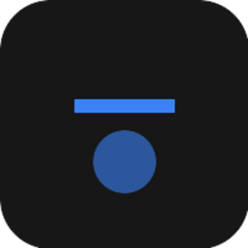

# Rein - Remote Input Control

<p align="center">
  
</p>

<p align="center">
  <strong>A cross-platform, LAN-based remote input controller</strong>
</p>

<p align="center">
  <a href="https://github.com/imxade/rein/blob/main/LICENSE">
    
  </a>
    <!-- Discord -->
    <a href="https://discord.gg/hjUhu33uAn">
    </a>
    &nbsp;&nbsp;
</p>

---

**Rein** allows touchscreen devices (phones, tablets) to act as a wireless **trackpad and keyboard** for your desktop computer through a locally served web interface. No apps to install on your mobile device – just open a browser!

## 🚀 Features

- **📱 Trackpad Control**: Use your phone as a wireless trackpad with gesture support
  - Single finger: Move cursor
  - Single tap: Left click
  - Two-finger tap: Right click
  - Three-finger tap: Middle click
  - Two-finger swipe: Scroll
  - Tap-and-drag: Drag and drop
- **⌨️ Keyboard Input**: Type using your phone's native keyboard
- **🔗 QR Code Connection**: Scan to connect instantly
- **🌐 Cross-Platform**: Works on Windows, macOS, and Linux
- **🔒 LAN-Only**: All communication stays on your local network

## 💻 Tech Stack

| Layer | Technology |
|-------|------------|
| **Framework** | [TanStack Start](https://tanstack.com/start) |
| **Language** | TypeScript |
| **Frontend** | React 19 |
| **Styling** | Tailwind CSS + DaisyUI |
| **Real-time** | WebSocket (`ws`) |
| **Input Simulation** | [@nut-tree-fork/nut-js](https://github.com/nut-tree/nut.js) |
| **Build Tool** | Vite |

## 🏗️ Architecture

```
┌─────────────────────────────────────────────────────────────────┐
│                    DESKTOP (Server)                              │
│  ┌────────────────────────────────────────────────────────────┐ │
│  │  Vite Dev Server (TanStack Start)                          │ │
│  │  ├── Web UI (React)      ← localhost:3000                  │ │
│  │  └── WebSocket Server    ← /ws endpoint                    │ │
│  │          ↓                                                 │ │
│  │    InputHandler (nut.js) → OS Input APIs                   │ │
│  └────────────────────────────────────────────────────────────┘ │
└─────────────────────────────────────────────────────────────────┘
                              ↕ WebSocket (LAN)
┌─────────────────────────────────────────────────────────────────┐
│                     MOBILE (Browser Client)                      │
│  Opens http://<desktop-ip>:3000/trackpad                        │
│  Touch gestures → WebSocket → Desktop cursor/keyboard           │
└─────────────────────────────────────────────────────────────────┘
```

## 🔄 User Flow

1. **Start Server**: Run Rein on your desktop
2. **Connect**: Scan QR code or enter URL on your phone
3. **Control**: Use touch gestures to control your desktop

## 🚀 Getting Started

### Prerequisites

- **Node.js** 18+ (LTS recommended)
- **npm** (comes with Node.js)
- Both devices on the **same Wi-Fi network**

### Installation

1. **Clone the Repository**
   ```bash
   git clone https://github.com/AOSSIE-Org/rein.git
   cd rein
   ```

2. **Install Dependencies**
   ```bash
   npm install
   ```

3. **Start the Development Server**
   ```bash
   npm run dev
   ```

4. **Open the Settings Page**
   
   Navigate to `http://localhost:3000/settings` on your desktop

5. **Connect Your Mobile Device**
   - Scan the QR code with your phone, OR
   - Manually enter `http://<YOUR_PC_IP>:3000/trackpad`

### Firewall Configuration

Ensure port **3000** is allowed through your firewall:

**Windows:** Allow through Windows Defender Firewall

**Linux (UFW):**
```bash
sudo ufw allow 3000/tcp
```

**macOS:** May need to allow in System Preferences → Security & Privacy

## 📱 Usage Tips

| Gesture | Action |
|---------|--------|
| Swipe (1 finger) | Move cursor |
| Tap (1 finger) | Left click |
| Tap (2 fingers) | Right click |
| Tap (3 fingers) | Middle click |
| Swipe (2 fingers) | Scroll |
| Toggle "Scroll Mode" | Single finger scrolling |
| Tap "Keyboard" button | Open phone keyboard |

## ⚠️ Known Limitations

### Linux/Wayland

On Wayland compositors (GNOME, KDE Plasma with Wayland), cursor movement may desync. This is due to Wayland's security model isolating XWayland applications. This is a priority improvement area.

### macOS

Requires Accessibility permissions:
- Go to System Preferences → Security & Privacy → Privacy → Accessibility
- Add Terminal or your IDE

## 🔗 Links

- **Repository**: [github.com/AOSSIE-Org/rein](https://github.com/AOSSIE-Org/rein)
- **Wiki & Documentation**: [github.com/imxade/rein/wiki](https://github.com/imxade/rein/wiki)
- **Discord**: [AOSSIE Discord](https://discord.gg/hjUhu33uAn)

## 🙌 Contributing

⭐ Don't forget to star this repository if you find it useful! ⭐

We welcome contributions! Please read our [Contributing Guidelines](./CONTRIBUTING.md) before getting started.

**Important:** All communication happens on Discord. Join the [AOSSIE Discord server](https://discord.gg/hjUhu33uAn) and discuss in **Projects/Rein**.

## ✨ Maintainers

- [@imxade](https://github.com/imxade) (Rituraj)

## 📍 License

This project is licensed under the **Apache License 2.0**. See the [LICENSE](./LICENSE) file for details.

## 💪 Thanks To All Contributors

Thanks a lot for spending your time helping Rein grow. Keep rocking! 🥂

<a href="https://github.com/AOSSIE-Org/rein/graphs/contributors">
  
</a>

---

<p align="center">
  © 2026 AOSSIE
</p>
